## Welcome to My GitHub Profile!

## Hi there !🫡🙌 
## I’m Hamid, a developer from Iran.

## 🐍 Auto-Moving Snake Game

Watch the snake 🐍 chase colorful fish 🐟 (red, yellow, blue) or collect gold 💰 for extra points! The snake moves automatically in an 854x300 field. Fish give 1 point, gold gives 5 points. The game stops if the snake hits the walls or itself.

## 🛠️ Skills
- HTML, CSS, JavaScript
- Python
- Turtle
- SVG Animations

## 📫 Connect with Me
- [LinkedIn](https://www.linkedin.com/in/your-linkedin-profile) *(Add your LinkedIn URL)*
- [Email](mailto:your.email@example.com) *(Add your email)*

Enjoy watching the snake and explore my projects below! 🚀
